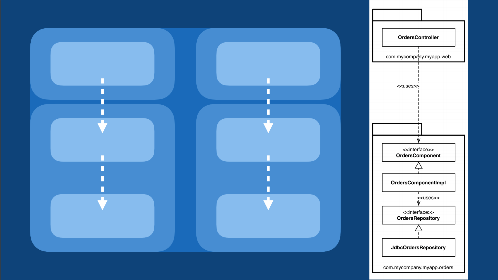
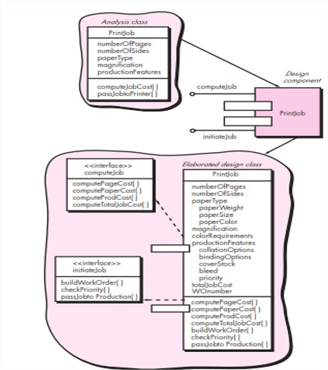
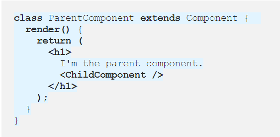
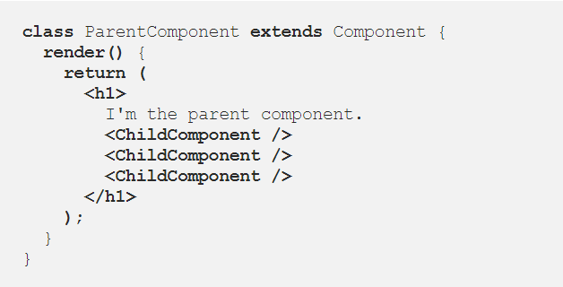

# **Component-Based Architecture**

A component is a modular building block for computer software. 

## **Views of a Component**

**1- Object-oriented view**

**2- Conventional view**

**3- Process-related view**

## **Characteristics of Components**

**1- Reusability** − Components are usually designed to be reused in different situations in different applications. However, some components may be designed for a specific task.

**2- Replaceable** − Components may be freely substituted with other similar components.

**3- Not context specific** − Components are designed to operate in different environments and contexts.

**4- Extensible** − A component can be extended from existing components to provide new behavior.

**5- Encapsulated** − A A component depicts the interfaces, which allow the caller to use its functionality, and do not expose details of the internal processes or any internal variables or state.

**6- Independent** − Components are designed to have minimal dependencies on other components.

## **Advantages**

**Ease of deployment** − As new compatible versions become available, it is easier to replace existing versions with no impact on the other components or the system as a whole.

**Reduced cost** − The use of third-party components allows you to spread the cost of development and maintenance.

**Ease of development** − Components implement well-known interfaces to provide defined functionality, allowing development without impacting other parts of the system.

**Reusable** − The use of reusable components means that they can be used to spread the development and maintenance cost across several applications or systems.

**Modification of technical complexity** − A component modifies the complexity through the use of a component container and its services.

**Reliability** − The overall system reliability increases since the reliability of each individual component enhances the reliability of the whole system via reuse.

**System maintenance and evolution** − Easy to change and update the implementation without affecting the rest of the system.

**Independent** − Independency and flexible connectivity of components. Independent development of components by different group in parallel. Productivity for the software development and future software development.

# **React-JS/Props**

**“Props”** is a special keyword in React, which stands for properties and is being used for passing data from one component to another.

***ParentComponent***

***ChildComponent***

