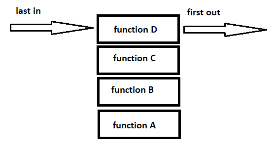

## Understanding the JavaScript Call Stack

**1-What is a ‘call’?**

a call is a single function invocation

**2-How many ‘calls’ can happen at once?**

one call can happen at once. The stack is synchronous.

**3-What does LIFO mean?**

Last in, first out.like making a stack of cookies.the last cookies placed on the stack will be on the top and the first one to eat.

**4-Draw an example of a call stack and the functions that would need to be invoked to generate that call stack.**

**5-What causes a Stack Overflow?**

where there is a recursive function that calls itself,without an exit point.

## JavaScript error messages

**1-What is a ‘refrence error’?**

Your code is referencing a variable or function that has not been declared.

**2-What is a ‘syntax error’?**
Improper use of syntax that results in the code not being parsed correctly

**3-What is a ‘range error’?**

Accessing an array at an index that does not exist , in the given array.

**4-What is a ‘tyep error’?**

Trying to use or access anumber, string.... but it is incompatible with what you are trying to perform.

**5-What is a breakpoint?**

A breakpoint is a set at a location in your code that you wish to examine . it willpause the code at that point, where you can then look at what is happening and the state of your code.

**6-What does the word ‘debugger’ do in your code?**

It's another way of setting abreakpoint for debugging purposes.