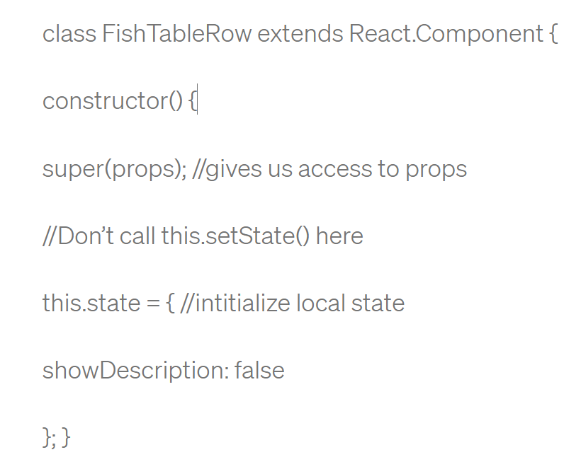
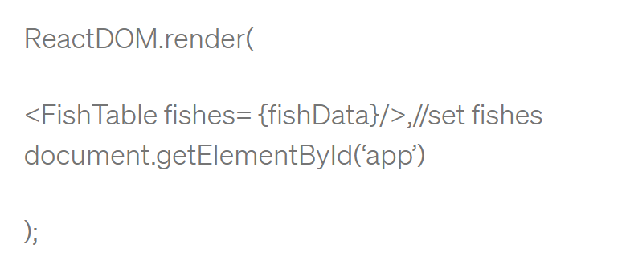
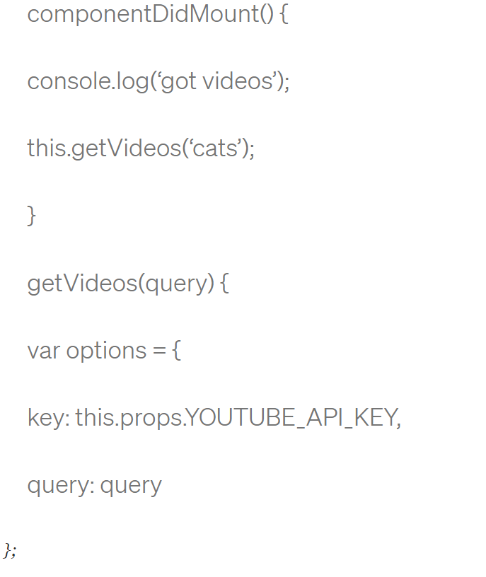
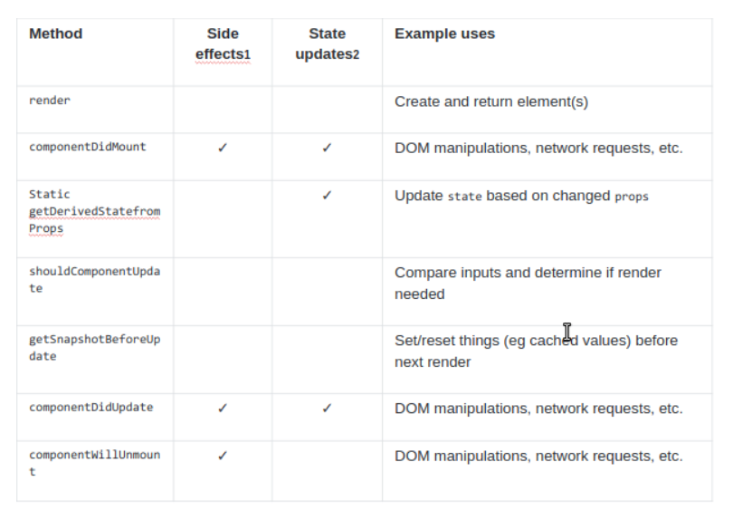

# **React: Component Lifecycle Events**

React lets you define components as classes or functions. The methods that you are able to use on these are called lifecycle events.** These methods can be called during the lifecycle of a component, and they allow you to update the UI and application states.**

### The three phases of the component lifecycle.

**1-Mounting ** : When an instance of a component is being created and inserted into the DOM it occurs during the mounting phase.

All occur in this order during mounting:

1- Constructor, 

2- static getDerivedStateFromProps,

 3- render,
 
  4- componentDidMount,
  
  5-  and UNSAFE_componentWillMount .

  

**2- Updating  ** : Anytime a component is updated or state changes then it is rerendered. 

These lifecycle events happen during updating in this order:

1- static getDerivedStateFromProps,

2- shouldComponentUpdate,

3- render,

4- getSnapshotBeforeUpdate,

5- componentDidUpdate, 

6- UNSAFE_componentWillUpdate,

7- UNSAFE_componentWillReceiveProps.

**3- Unmounting** : The final phase of the lifecycle if called when a component is being removed from the DOM.
 **componentWillUnmount** is the only lifecycle event during this phase.

 ### *constructor()*
 constructors can be used to assign state using this.state or to bind event handle methods to an instance.

### *static getDerivedStateFromProps()*

This method exists for rare cases where the state relies on changes in props over time.

### *render()*

Render is the only required method in a class component. It will examine this.props and this.state when called.

 render will not be invoked if shouldComponentUpdate() returns false.

 

 ### *componentDidMount()*

 This method is invoked immediately after a component is mounted.If you need to load anything using a network request or initialize the DOM.

 

### *shouldComponentUpdate()*

The default behavior in react is to rerender after every state change.If you want to use this method, it may be better to use PureComponent instead, which performs a shallow comparison of props and state.
be sure to check the previous props and state with the current props and state. If shouldComponentUpdate() returns false, then UNSAFE_componentWillUpdate(), render(), and componentDidUpdate() will not be invoked.

### *getSnapshotBeforeUpdate()*

This is another rarely used method that allows you to capture a picture of the DOM to check it before actually changing anything on the DOM.

**Here is a handy chart to help you keep track of the lifecycle events**:

To Know More About COMPONENTS: [React.Component](https://reactjs.org/docs/react-component.html)

