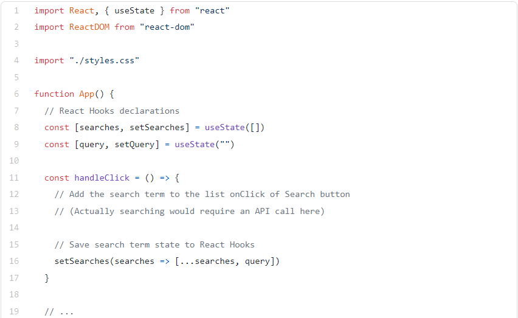
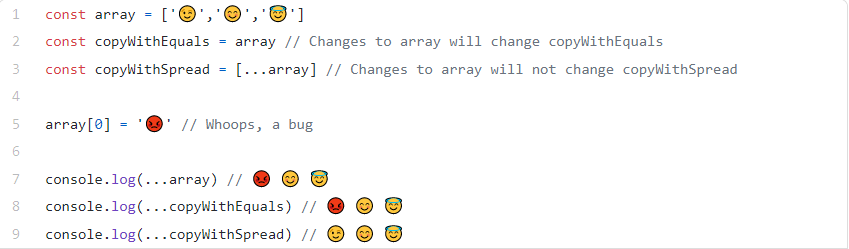

## Lists and Keys

**Rendering Multiple Components**

You can build collections of elements and include them in JSX using curly braces {}.

     const numbers = [1, 2, 3, 4, 5];
     const doubled = numbers.map((number) => number * 2);
     console.log(doubled);

Below, we loop through the numbers array using the JavaScript **map()** function. We return a `<li>` element for each item. Finally we assign the resulting array of elements to listItems:

     const numbers = [1, 2, 3, 4, 5];
     const listItems = numbers.map((number) =>
     <li>{number}</li>
     );

     ReactDOM.render(
     <ul>{listItems}</ul>,
     document.getElementById('root')
     );  

 Assign a key to our list items inside numbers.map() and fix the missing key issue. 

        function NumberList(props) {
        const numbers = props.numbers;
        const listItems = numbers.map((number) =>
            <li key={number.toString()}>
            {number}
            </li>
        );
        return (
            <ul>{listItems}</ul>
        );
        }

 To know more about this title , [CLICK HERE.](https://www.youtube.com/watch?v=c05OL7XbwXU)       

const numbers = [1, 2, 3, 4, 5];
ReactDOM.render(
  <NumberList numbers={numbers} />,
  document.getElementById('root')
);

## Spread Operator (…) in JavaScript

**spread operator** is a useful and quick syntax for adding items to arrays, combining arrays or objects, and spreading an array out into a function’s arguments.Use of an ellipsis of three dots` (…)` to expand an iterable object into the list of arguments.

      Math.max(1,3,5) // 5

     Math.max([1,3,5]) // NaN

Trying to pass an array to a JavaScript function expecting separate arguments does not work. In this case it produces a NaN result. Enter …:

    Math.max(...[1,3,5]) // 5

**What else can … do?**

1- Copying an array

2- Concatenating or combining arrays

3- Using Math functions

4- Using an array as arguments

5- Adding an item to a list

6- Adding to state in React

7- Combining objects

8- Converting NodeList to an array

**A note about copying by reference**

One of the benefits of using the spread operator is that it will create a new reference to its primitive values, copying them.

