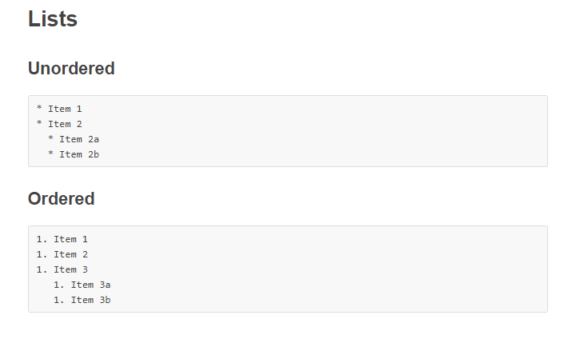

### _Markdown_
Markdown is an easy and useful markup and styling language for developers that they use between each others to complete and save  thier works but they cannot use it to create websites.
Markdown files ended with an extension(.md), also you can use it and edit its files in Github website which it uses its own version that provides an extra of features.

#### *For example for:

you can make a **list** by Markdown:

