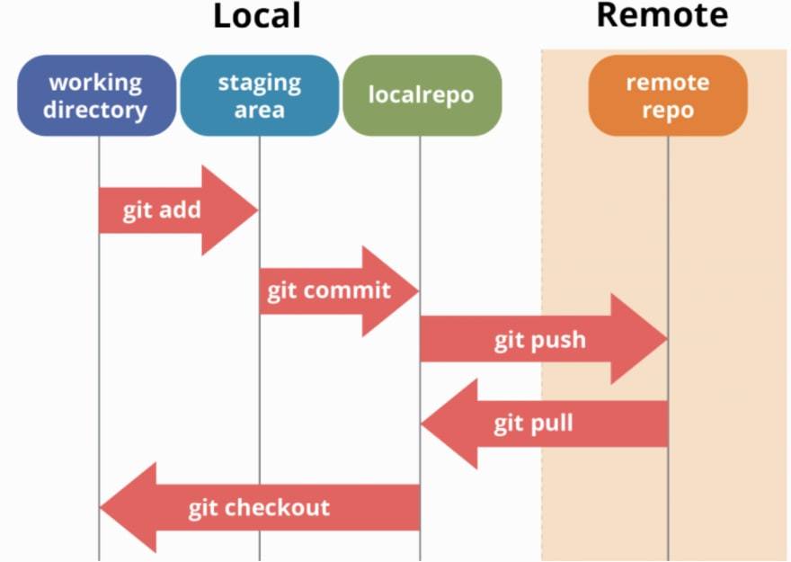

#  Git 

Fisrt of all, You need to understand what do (Version Control) mean. 
**Version Control** is a system that records changes to a file or set of files over time so that you can recall specific versions later.
VCS has three types:

1- [**Local VCS**](https://replit.com/@duajaradat/Reading-notes#Local.png) is an approach that the user keep it’s own file or saved the file by it’s own self, they manage they own file. But it is hard to maintenance the changes of the file.

2- [**Centralized Version Control**](https://replit.com/@duajaradat/Reading-notes#CVCS.png) is a way to track changes on project, but differently with local VCS, this way we save the version on the server, with history changes saved in the server.

3- [**Distributed VCS**](https://replit.com/@duajaradat/Reading-notes#DVCS.png) as the inverse of the Centralized VCS, it gives all the management of the project in the developer side, not server side, you can checkout the branch without connecting to server, even you can commit changes, trace changes that you have made even without internet connection.

**Git** is a Distributed Version Control System or DVCS. VCS is basically software designed to record changes within one or more files over time. It allows us to undo or to cancel all made or pending changes within one or more files. If we're working on a project with many files, VCS enables us to control the whole project. If necessary, this allows us to revert one or more files any of their previous versions or the whole project to a previous version. We can also compare changes to one file between two versions in order to see exactly what was changed in each file, when it was changed and who made the change. We can also see why the change was made.Files in **Git** can reside in three main states: committed, modified and staged.Also **Git** includes inherent Graphical User Interface (GUI) tools.

If you want to download **Git** on your computer,you should make sure you have the latest version.
**Git** can be installed by visiting this [link](http://git-scm.com/download/mac) and following the posted directions.

After making sure **Git** has been installed, you should perform some customization steps, you can repeat these steps.

*Configuration of Variables:An inherent **Git** tool called git config allows the setting of configuration variables that control aspects of **Git’s** operation and look.

Identity Setting:After installing **Git**, users should immediately set the user name and email address, which will be used for every **Git** commit.

**Git Commands Flashcards**

1- clone an existing repository: *git clone+link(ssh://user@domain.com/repo.git)*.

2- create a new local repository: *git init*.

3- show changed files in your local directory: *git status*.

**To make a repository 

**Git Workflow**

Remote Repositories
In order to collaborate on Git projects, you must interact with remote repositories, versions of a project residing online or on a network. You can work with multiple repositories, for which you can have read/write or read-only privileges. Teams can use remote repositories to push information to and pull data from.

**For Example**

You can also specify -v, which shows you the URLs that Git has stored for the shortname to be used when reading and writing to that remote:

 [git remote -v]

`origin	https://github.com/schacon/ticgit (fetch)`
`origin	https://github.com/schacon/ticgit (push)`