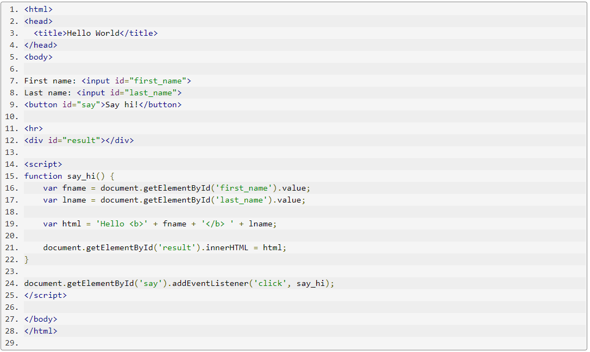
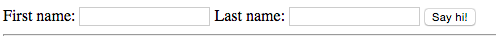

## *JavaScript*

[**JavaScript**](https://www.w3schools.com/js/default.asp)is a prototype-based, multi-paradigm, single-threaded, dynamic language.[**JavaScript**](https://www.w3schools.com/js/default.asp) runs on the client side of the web, which can be used to design / program how the web pages behave on the occurrence of an event.[**JavaScript**](https://www.w3schools.com/js/default.asp) is an easy to learn and also powerful scripting language, widely used for controlling web page behavior.
[**JavaScript**](https://www.w3schools.com/js/default.asp) is a programming language that allows you to implement complex things on web pages. Every time a web page does more than just sit there and display static information for you to look at—displaying timely content updates, interactive maps, animated 2D/3D graphics, scrolling video jukeboxes, or more—you can bet that JavaScript is probably involved.

In this example we have a bit more HTML than earlier. In addition to having a button, and a div element where we'll show our results, we also have two input elements. Each one with its own ID.

If you click on the Try link, you'll see two input boxes and a button:

 
 To know more about [**JavaScript**](https://www.w3schools.com/js/default.asp)click on it.

