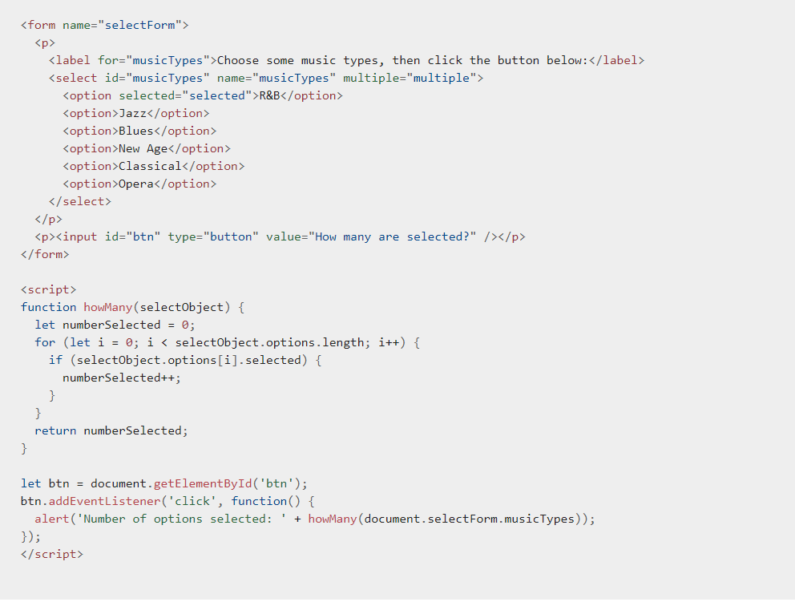
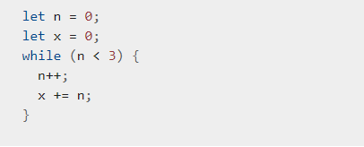

# *Expressions and operators*
## [Operators](https://www.w3schools.com/js/js_operators.asp)
JavaScript has both binary and unary operators, and one special ternary operator, the conditional operator. A binary operator requires two operands, one before the operator and one after the operator.

For Example: `3+4 or x*y.`.

A unary operator requires a single operand, either before or after the operator.

For Example: `x++ or ++x`.

*There are many types of operators:*

1- Assignment operators.

2- Comparison operators.

3- Arithmetic operators.

4- Bitwise operators.

5- Logical operators.

6- String operators

7- Conditional (ternary) operator

8- Comma operator

9- Unary operators

10- Relational operators

## [Expressions]

An expression is any valid unit of code that resolves to a value.

Every syntactically valid expression resolves to some value but conceptually, there are two types of expressions: with side effects (for example: those that assign value to a variable) and those that in some sense evaluate and therefore resolve to a value.

**JavaScript has the following expression categories:**

1- Arithmetic: evaluates to a number, for example 3.14159. (Generally uses arithmetic operators.)

2- String: evaluates to a character string, for example, "Fred" or "234". (Generally uses string operators.)

3- Logical: evaluates to true or false. (Often involves logical operators.)

4- Primary expressions: Basic keywords and general expressions in JavaScript.

5- Left-hand-side expressions: Left values are the destination of an assignment.

## [Loops and iteration](https://developer.mozilla.org/en-US/docs/Web/JavaScript/Guide/Loops_and_iteration)

**Loops** offer a quick and easy way to do something repeatedly.

There are many different kinds of loops, but they all essentially do the same thing: they repeat an action some number of times. (Note that it's possible that number could be zero!)

*The statements for loops provided in JavaScript are:

1- for statement

2- do...while statement

3- while statement

4- labeled statement

5- break statement

6- continue statement

7- for...in statement

8- for...of statement

**For Statement**

A for loop repeats until a specified condition evaluates to false. The JavaScript for loop is similar to the Java and C for loop.

*When a for loop executes, the following occurs:

1- The initializing expression initialExpression, if any, is executed. This expression usually initializes one or more loop counters, but the syntax allows an expression of any degree of complexity. This expression can also declare variables.

2-The conditionExpression expression is evaluated. If the value of conditionExpression is true, the loop statements execute. If the value of condition is false, the for loop terminates. (If the condition expression is omitted entirely, the condition is assumed to be true.)

3-The statement executes. To execute multiple statements, use a block statement ({ ... }) to group those statements.

4-If present, the update expression incrementExpression is executed.
Control returns to Step 2.

**While Statement**

A while statement executes its statements as long as a specified condition evaluates to true. A while statement looks as follows:

*while (condition)*

  *statement*

  

