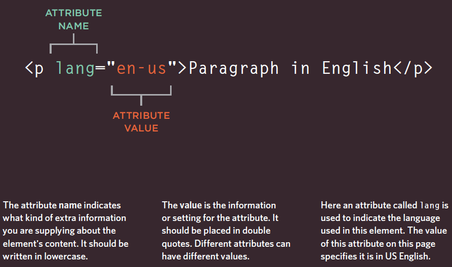

# *the Duckett HTML book*

## *Introduction*

It's not that hard to learn how
to write web pages and read
the code used to create them;
you certainly don't have to be a
"programmer."

**Search engine optimization (SEO)** is the process of improving the quality and quantity of website traffic to a website or a web page from search engines.[
### HTML
We will spend the first chapter
looking at how HTML is used to
create web pages. You will see
that you start by writing down
the words you want to appear
on your page. You then add tags
or elements to the words so
that the browser knows what is
a heading, where a paragraph
begins and ends, and so on.**HTML5** is the latest
version of HTML (still under
development at the time of
writing).

### CSS
We start this section with a
chapter that explains how CSS
uses rules to enable you to
control the styling and layout
of web pages. We then go on to
look at the wide variety of CSS
properties you can use in your
CSS rules. These properties
generally fall into one of two
categories:
**Presentation:** How to control
things like the color of text, the
fonts you want to use and the
size of those fonts, how to add
background colors to pages.

**Layout:** How to control where
the different elements are
positioned on the screen.

**different ways in which people access the web
and clarify some terminology:

1- Browsers

2- Web Servers

3- Screen readers

4- Devices

## *CH01: STRUCTURE*

To describe the structure of a web page, we add code to the words we want
to appear on the page.You can see the **HTML** code for this page below.Note that the HTML code is in blue, and the text you see on screen
is in black.

**The HTML** code (in blue) is made up of characters that live inside angled
brackets — these are called HTML elements. Elements are usually
made up of two tags: an opening tag and a closing tag. (The closing tag
has an extra forward slash in it.) Each HTML element tells the browser
something about the information that sits between its opening and
closing tags.

Tags act like containers. They tell you
something about the information that lies
between their opening and closing tags.

**Description :**
The opening `<html>` tag indicates that anything between it and a closing `</html>` tag is HTML code.

The `<body>` tag indicates that anything between it and the closing
`</body>` tag should be shown inside the main browser window.

Words between `<h1>` and `</h1>` are a main heading.

**Attributes** provide additional information
about the contents of an element. They appear
on the opening tag of the element and are
made up of two parts: a name and a value,
separated by an equals sign.

## *CH08: EXTRA MARKUP*

`<!DOCTYPE html>`

Because there have been
several versions of **HTML**, each
web page should begin with a
DOCTYPE declaration to tell a
browser which version of HTML
the page is using (although
browsers usually display the
page even if it is not included).

Because **XHTML** was written
in XML, you will sometimes
see pages that use the XHTML
strict DOCTYPE start with
the optional XML declaration.
Where this is used, it should be
the first thing in a document.
There must be nothing before it,
not even a space.
`<?xml version="1.0" ?>`

`<!-- -->`

If you want to add a comment
to your code that will not be
visible in the user's browser, you
can add the text between these
characters:
`<!-- comment goes here -->`

**ID Attribute**

Every HTML element can carry
the id attribute. It is used to
uniquely identify that element
from other elements on the
page. Its value should start with
a letter or an underscore (not a
number or any other character).
It is important that no two
elements on the same page
have the same value for their id
attributes (otherwise the value is
no longer unique).
The **ID** attribute is known as a
global attribute because it can
be used on any element.

`
`

**Class attribute**

Every HTML element can
also carry a class attribute.
Sometimes, rather than uniquely
identifying one element within
a document, you will want a
way to identify several elements
as being different from the
other elements on the page.
For example, you might have
some paragraphs of text that
contain information that is more
important than others and want
to distinguish these elements, or
you might want to differentiate
between links that point to other
pages on your own site and links
that point to external sites.

`
`

**Block Elements**

Some elements will always
appear to start on a new line in
the browser window. These are
known as block level elements (`<h1>`, `
`, `<ul>`, and `<li>`).

**INLINE elements**

Some elements will always
appear to continue on the
same line as their neighbouring
elements. These are known as
inline elements(`<a>`, `<b>`, `<em>`, and ``).

**Grouping Text and Elements in a Block**

`
`

The 
 element allows you to
group a set of elements together
in one block-level box.

**Escape Characters**

There are some characters that are used in
and reserved by HTML code. (For example, the
left and right angled brackets.)

## *CH17: HTML5 Layout*

## *CH18: Process & Design*

Every website should be designed for the
target audience—not just for yourself or the
site owner. It is therefore very important to
understand who your target audience is.

Now that you know who your visitors are, you
need to consider why they are coming. While
some people will simply chance across your
website, most will visit for a specific reason.

You know who is coming to your site and why
they are coming, so now you need to work out
what information they need in order to achieve
their goals quickly and effectively.

Some sites benefit from being updated more
frequently than others. Some information (such
as news) may be constantly changing, while
other content remains relatively static.

Now that you know what needs to appear
on your site, you can start to organize the
information into sections or pages.

A wireframe is a simple sketch of the key
information that needs to go on each page of a
site. It shows the hierarchy of the information
and how much space it might require.

The primary aim of any kind of visual design
is to communicate. Organizing and prioritizing
information on a page helps users understand
its importance and what order to read it in.

The primary aim of any kind of visual design
is to communicate. Organizing and prioritizing
information on a page helps users understand
its importance and what order to read it in.

When making sense of a design, we tend to organize visual elements
into groups. Grouping related pieces of information together can make a
design easier to comprehend. Here are some ways this can be achieved.

Site navigation not only helps people find where they want to go, but also
helps them understand what your site is about and how it is organized.
Good navigation tends to follow these principles...

# *the Duckett JS book*

## *Introduction*
How JS makes web pages more interactive?

**1- ACCESS CONTENT**

You can use JavaScript to select any
element, attribute, or text from an
HTML page. For example:

• Select the text inside all of the `<hl>`
elements on a page.

• Select any elements that have a
c1ass attribute with a value of note.

• Find out what was entered into a
text input whose id attribute has a
value of emai1.

**2- MODIFY CONTENT**

You can use JavaScript to add
elements, attributes, and text to the
page, or remove them. For example:

• Add a paragraph of text after the
first `<hl>` element.

• Change the value of class
attributes to trigger new CSS rules
for those elements.

• Change the size or position of an
`` element.

**3-PROGRAM RULES**

You can specify a set of steps for
the browser to follow (like a recipe),
which allows it to access or change the
content of a page. For example:

• A gallery script could check which
image a user clicked on and display
a larger version of that image.

• A mortgage calculator could collect
values from a form, perform a
calculation, and display repayments.

• An animation could check the
dimensions of the browser window
and move an image to the bottom
of the viewable area (also known as
the viewport).

**4- REACT TO EVENTS**

You can specify that a script should run
when a specific event has occurred. For
example, it could be run when:

• A button is pressed

• A link is clicked (or tapped) on.

• A cursor hovers over an element.

• Information is added to a form.

• An interval of time has passed.

• A web page has finished loading.

## *THE ABC OF PROGRAMMING*

First of all, You need to know what is a **script**?
A **script** is a series of instructions that a
computer can follow to achieve a goal.
A browser may use different parts of the **script** depending on how the user interacts with the web page.**Scripts** can run different sections of the code in response  to the situation around them.

To write a script, you need to first
state your goal and then list the
tasks that need to be completed in
order to achieve it.Start with the big picture of what
you want to achieve, and break
that down into smaller steps.

**1- DEFINE THE GOAL**
First, you need to define the task you want to
achieve. You can think of this as a puzzle for the
computer to solve.

**2- DESIGN THE SCRIPT**
To design a script you split the goal out into a series
of tasks that are going to be involved in solving this
puzzle. This can be represented using a flowchart.
You can then write down individual steps that the
computer needs to perform in order to complete
each individual task (and any information it needs to
perform the task), rather like writing a recipe that it
can follow.

**3- CODE EACH STEP**
Each of the steps needs to be written in a
programming language that the compu ter
understands. In our case, this is JavaScript. 

**FROM STEPS
TO CODE**

Every step for every task shown
in a flowchart needs to be written
in a language the computer can
understand and follow.

***HOW A BROWSER
SEES A WEB PAGE***

1- RECEIVE A PAGE AS
HTML CODE.

2- CREATE A MODEL OF
THE PAGE AND STORE
IT IN MEMORY.

3- USE A RENDERING
ENGINE TO SHOW THE
PAGE ON SCREEN.

***HOW TO WRITE A SCRIPT FOR A WEB PAGES***

JavaScript is written in plain text, just like HTML and CSS, so you do not
need any new tools to write a script.

When you want to use JavaScript with a web page, you use the HTML
`<script>` element to tell the browser it is coming across a script.
Its src attribute tells people where the JavaScript file is stored.

