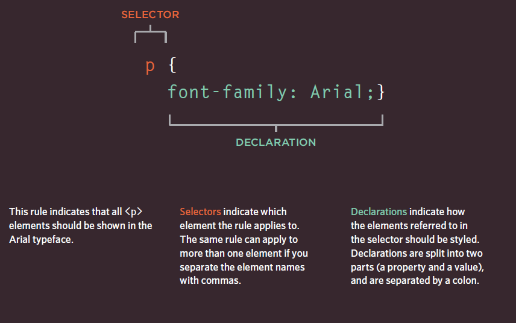
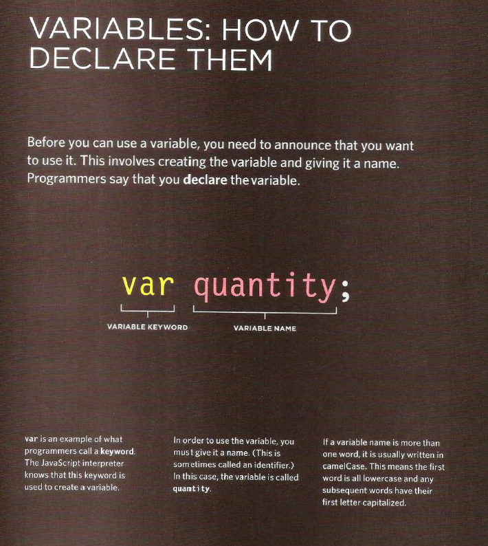

# *The Duckett HTML book*

## *CH02: TEXT*

### **Headings**
HTML has six "levels" of
headings:
`<h1>`is used for main headings
`<h2>` is used for subheadings
If there are further sections
under the subheadings then the
`<h3>` element is used, and so
on...

### **Paragraph**

To create a paragraph, surround
the words that make up the
paragraph with an opening `
`
tag and closing `
` tag.

### **Bold & Italic**

`<b>`

By enclosing words in the tags
`<b>` and `</b>` we can make
characters appear bold.
The `<b>` element also represents
a section of text that would be
presented in a visually different
way (for example key words in a
paragraph) although the use of
the `<b>` element does not imply
any additional meaning.

`<i>`
By enclosing words in the tags
`<i>` and `</i>` we can make
characters appear italic.
The `<i>` element also represents
a section of text that would be
said in a different way from
surrounding content — such as
technical terms, names of ships,
foreign words, thoughts, or other
terms that would usually be
italicized.

### *Line Breaks & Horizontal Rules**

` `
As you have already seen, the
browser will automatically show
each new paragraph or heading
on a new line. But if you wanted
to add a line break inside the
middle of a paragraph you can
use the line break tag ` `.

`
`
To create a break between
themes — such as a change of
topic in a book or a new scene
in a play — you can add a
horizontal rule between sections
using the `
` tag.

### **Semantic Markup**

There are some text elements that are not intended to affect the structure of your web pages, but they do add extra information to the pages — they are known as semantic markup.

### **Strong & Emphasis**

`<strong>`
The use of the `<strong>`
element indicates that its
content has strong importance.
For example, the words
contained in this element might
be said with strong emphasis.
By default, browsers will show
the contents of a `<strong>`
element in bold.

`<em>`
The `<em>` element indicates
emphasis that subtly changes
the meaning of a sentence.
By default browsers will show
the contents of an `<em>` element
in italic.

## *CH10: Introducing CSS*

**CSS** works by associating rules with HTML elements. These rules govern
how the content of specified elements should be displayed. A CSS rule
contains two parts: a selector and a declaration.

**Why use External Style Sheets?**

All of your web pages can share
the same style sheet. This is
achieved by using the `<link>`
element on each HTML page of
your site to link to the same CSS
document. This means that the
same code does not need to be
repeated in every page (which
results in less code and smaller
HTML pages).

Therefore, once the user has
downloaded the CSS stylesheet,
the rest of the site will load
faster. If you want to make a
change to how your site appears,
you only need to edit the one
CSS file and all of your pages
will be updated. For example,
you can change the style of
every `<h1>` element by altering the one CSS style sheet, rather
than changing the CSS rules on
every page. The HTML code
will be easier to read and edit
because it does not have lots of
CSS rules in the same document.
It is generally considered good
practice to have the content of
the site separated from the rules
that determine how it appears.

**Sometimes you might consider placing CSS rules in the same page as
your HTML code.**

If you are just creating a single
page, you might decide to put
the rules in the same file to
keep everything in one place.
(However, many authors would
consider it better practice to
keep the CSS in a separate file.)

If you have one page which
requires a few extra rules (that
are not used by the rest of the
site), you might consider using
CSS in the same page. (Again,
most authors consider it better
practice to keep all CSS rules in a
separate file.)

Most of the examples in this
book place the CSS rules in the
`<head>` of the document (using
the `<style>` element) rather
than a separate document. This
is simply to save you opening
two files to see how the CSS
examples work.

# *the Duckett JS book:*

## **CH02:Basic JavaScript Instructions**

A **script** is a series of instructions that a computer can follow one-by-one.
Each individual instruction or step is known as a statement.
Statements should end with a semicolon.

You should write **comments** to explain what your code does.
They help make your code easier to read and understand.
This can help you and others who read your code.

A script will have to temporarily
store the bits of information it
needs to do its job. It can store this
data in **variables.**

A **variable** is a good name for this
concept because the data stored
in a **variable** can change (or vary)
each time a script runs.

**DATA TYPES**

1- NUMERIC DATA TYPE

2- STRING DATA TYPE

3- BOOLEAN DATA TYPE

**Summary**
1- A script is made up of a series of statements. Each
statement is like a step in a recipe.

2- Scripts contain very precise instructions. For example,
you might specify that a value must be remembered
before creating a calculation using that value.

3- Variables are used to temporarily store pieces of
information used in the script.

4- Arrays are special types of variables that store more
than one piece of related information.

5- JavaScript distinguishes between numbers (0-9),
strings (text), and Boolean values (true or false).

6- Expressions evaluate into a single value.

7- Expressions rely on operators to calculate a value.

