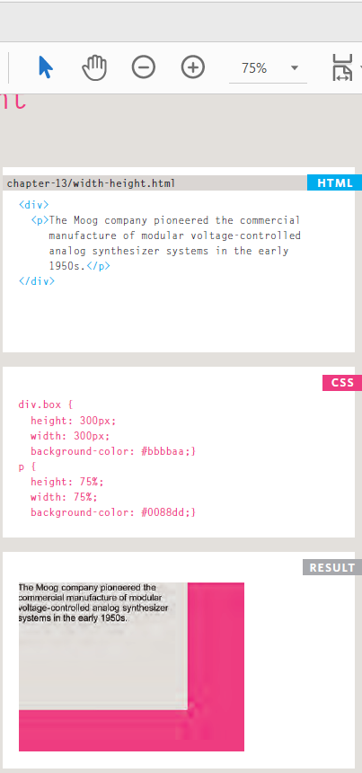
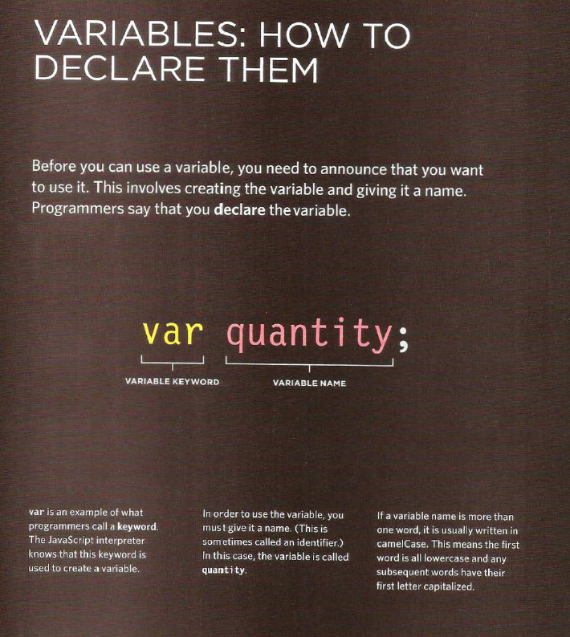

# *The Duckett HTML book*

## *CH03: LISTS*

HTML provides us with
three different types of Lists:

**1- Ordered lists**
`<ol>`
The ordered list is created with
the `<ol>` element.

`<li>`
Each item in the list is placed
between an opening `<li>` tag
and a closing `</li>` tag. (The li
stands for list item.)

**2- Unordered lists**

`<ul>`
The unordered list is created
with the `<ul>` element.

`<li>`
Each item in the list is placed
between an opening `<li>` tag
and a closing `</li>` tag. (The li
stands for list item.)
 
 

**3- Definition lists**

`<dl>`
The definition list is created with
the `<dl>` element and usually
consists of a series of terms and
their definitions.

Inside the `<dl>` element you will
usually see pairs of `<dt>` and
`<dd>` elements.

`<dt>`
This is used to contain the term
being defined (the definition
term).

`<dd>`
This is used to contain the
definition.

## *CH13: BOXS*
 
**BOXS Dimenstions**

By default a box is sized just big
enough to hold its contents. To
set your own dimensions for a
box you can use the height and
width properties.

**Limiting Width**

These are very helpful properties
to ensure that the content of
pages are legible (especially on
the smaller screens of handheld
devices). For example, you can
use the max-width property to
ensure that lines of text do not
appear too wide within a big
browser window and you can
use the min-width property
to make sure that they do not
appear too narrow.

`td.description {`

`min-width: 450px;`

`max-width: 650px;`

`text-align: left;`

`padding: 5px;`

`margin: 0px;}`

**Limiting Height**

Same thing for **HEIGHT**

`h2, p {`

`width: 400px;`

`font-size: 90%;`

`line-height: 1.2em;}`

`h2 {`

`color: #0088dd;`

`border-bottom: 1px solid #0088dd;}`

`p {`

`min-height: 10px;`

`max-height: 30px;}`

**Overflowing Content**

Overflow

The overflow property tells the
browser what to do if the content
contained within a box is larger
than the box itself. It can have
one of two values:

1- hidden

This property simply hides any
extra content that does not fit in
the box.

2- scroll

This property adds a scrollbar to
the box so that users can scroll
to see the missing content.

**Border, Margin & Padding**

**border-width**

The border-width property
is used to control the width
of a border. The value of this
property can either be given
in pixels or using one of the
following values:

thin,medium,thick

**border-style**

You can control the style of a
border using the border-style
property.

**border-color**

You can specify the color of a
border using either RGB values,
hex codes or CSS color names

**Display**

*inline*

This causes a block-level
element to act like an inline
element.

*block*

This causes an inline element to
act like a block-level element.

*inline-block*

This causes a block-level
element to flow like an inline
element, while retaining other
features of a block-level element.

*none*

This hides an element from the
page. In this case, the element
acts as though it is not on the
page at all (although a user could
still see the content of the box if
they used the view source option
in their browser).

**Hiding Boxes**
This property can take two
values:

*hidden*
This hides the element.

*visible*
This shows the element.

## **The Duckett JS book**

### **CH02:Basic JS Introduction**

A **script** is a series of instructions that a computer can follow one-by-one.
Each individual instruction or step is known as a statement.
Statements should end with a semicolon.

You should write **comments** to explain what your code does.
They help make your code easier to read and understand.
This can help you and others who read your code.

A script will have to temporarily
store the bits of information it
needs to do its job. It can store this
data in **variables.**

A **variable** is a good name for this
concept because the data stored
in a **variable** can change (or vary)
each time a script runs.

**DATA TYPES**

1- NUMERIC DATA TYPE

2- STRING DATA TYPE

3- BOOLEAN DATA TYPE

**Summary**
1- A script is made up of a series of statements. Each
statement is like a step in a recipe.

2- Scripts contain very precise instructions. For example,
you might specify that a value must be remembered
before creating a calculation using that value.

3- Variables are used to temporarily store pieces of
information used in the script.

4- Arrays are special types of variables that store more
than one piece of related information.

5- JavaScript distinguishes between numbers (0-9),
strings (text), and Boolean values (true or false).

6- Expressions evaluate into a single value.

7- Expressions rely on operators to calculate a value.

## **CH04:Decisions and Loops” from switch statements on**

**Evaluating Conditions and Conditional Statement**

**Comparison Operators**

**Logical Operators**

**LOOPS**

