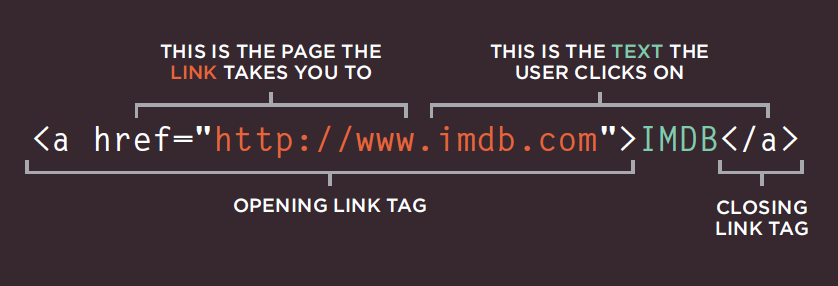
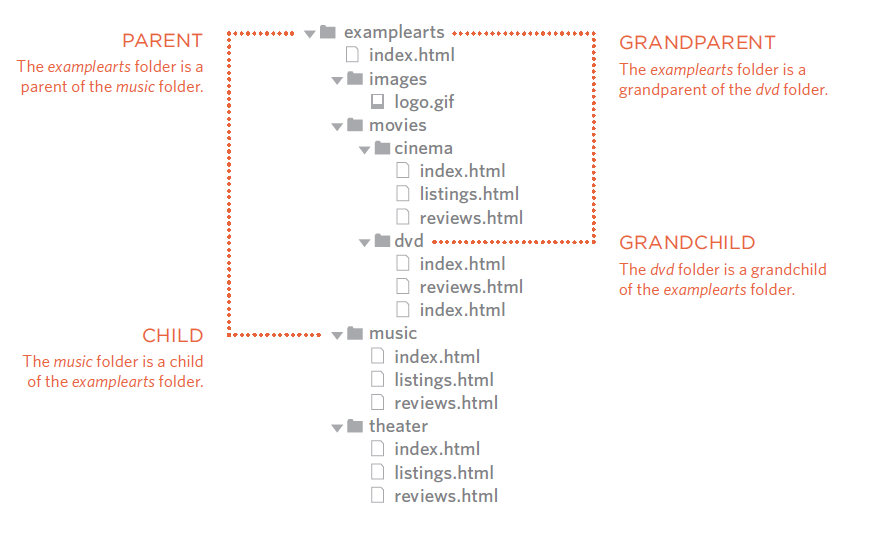
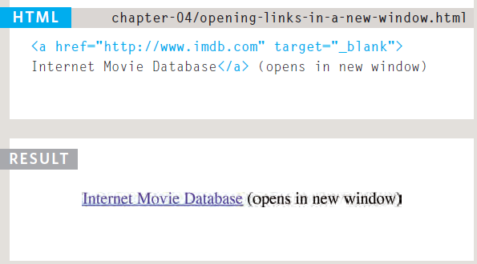

# *The Duckett HTML book*

## *CH04: LINKS*

Links are the defining feature of the web
because they allow you to move from
one web page to another — enabling the
very idea of browsing or surfing.

`****`

Links are created using the `<a>`
element which has an attribute
called href. The value of the
href attribute is the page that
you want people to go to when
they click on the link.

**Linking to Other Sites**

 other-sites.html HTML Links are created using the `<a>`
element which has an attribute
called href. The value of the
href attribute is the page that
you want people to go to when
they click on the link.

When you link to a different
website, the value of the href
attribute will be the full web
address for the site, which is
known as an *absolute URL.*

**Linking to Other Pages on the Same Site**

 When you are linking to other
pages within the same site,
you do not need to specify the
domain name in the URL. You
can use a shorthand known as a
*relative URL.*

**Directory Structure**

On larger websites it's a good idea to organize your code by placing the pages for each different section of the site into a new folder. Folders on a website are sometimes referred to as directories.

*Structure*

The diagram on the right shows
the directory structure for a
fictional entertainment listings
website called ExampleArts.

*Relationships*

The relationship between
files and folders on a website
is described using the same
terminology as a family tree.

*Home pages*

The main homepage of a site
written in HTML (and the
homepages of each section in a
child folder) is called index.html.

*Relative URLs*

Relative URLs can be used when linking to pages within your own website. They provide a shorthand way of telling the browser where to find your files.

**Relative Link Type**

1- Same Folder

`<a href="reviews.html">Reviews</a>`

2- Child Folder

`<a href="music/listings.html">Listings</a>`

3- Grandchild Folder

`<a href="movies/dvd/reviews.html">`

4-Grandchild Folder

`<a href="../index.html">Home</a>`

5-GrandParent Folder

`<a href="../../index.html">Home</a>`

**Email Links**

`<a href="mailto:jon@example.org">Email Jon</a>`

the result: "Email jon".

**Opening Links in a New Window**

If you want a link to open in a new window, you can use the target attribute on the opening `<a>` tag. The value of this attribute should be _blank.

## *CH15: LAYOUT*

how to control where each element sits on a page and how to create attractive page layouts.

**Building Blocks**

CSS treats each HTML element as if it is in its
own box. This box will either be a block-level
box or an inline box.

*Block-level* boxes start on a new line and act as the main building blocks of any layout, while *inline boxes* flow between surrounding text. You can control how much space each box takes up by setting the width of the boxes (and sometimes the height, too). To separate boxes, you can use borders, margins, padding, and background colors.

**Block-level elements**

start on a new line, Examples include:

`<h1>` `
` `<ul>` `<li>`

**Inline elements**

flow in between surrounding text,Examples include:

`` `<b>` `<i>`

