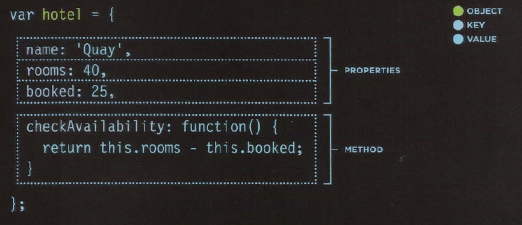
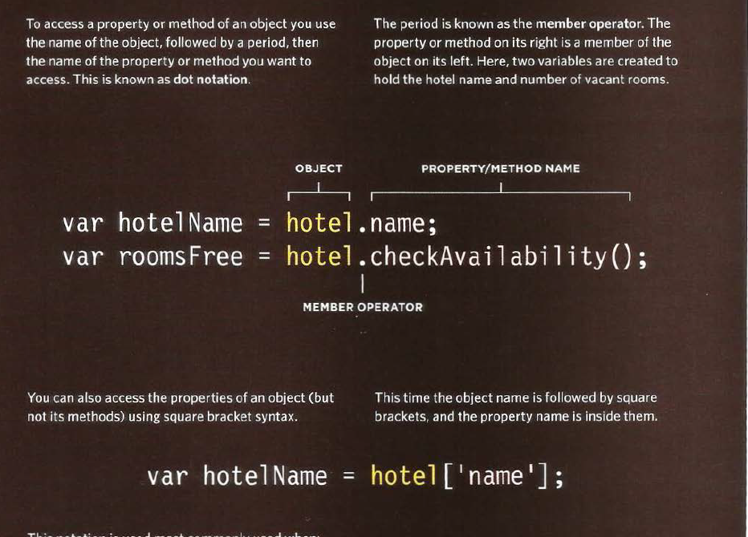
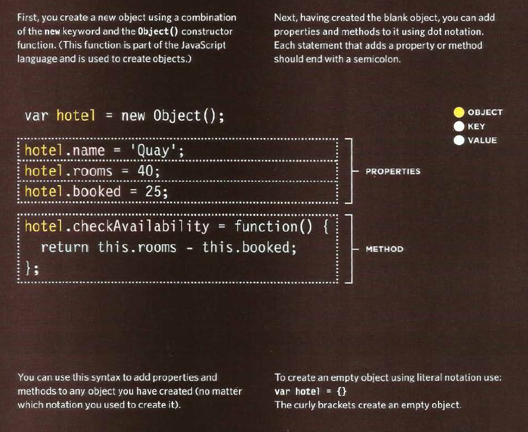
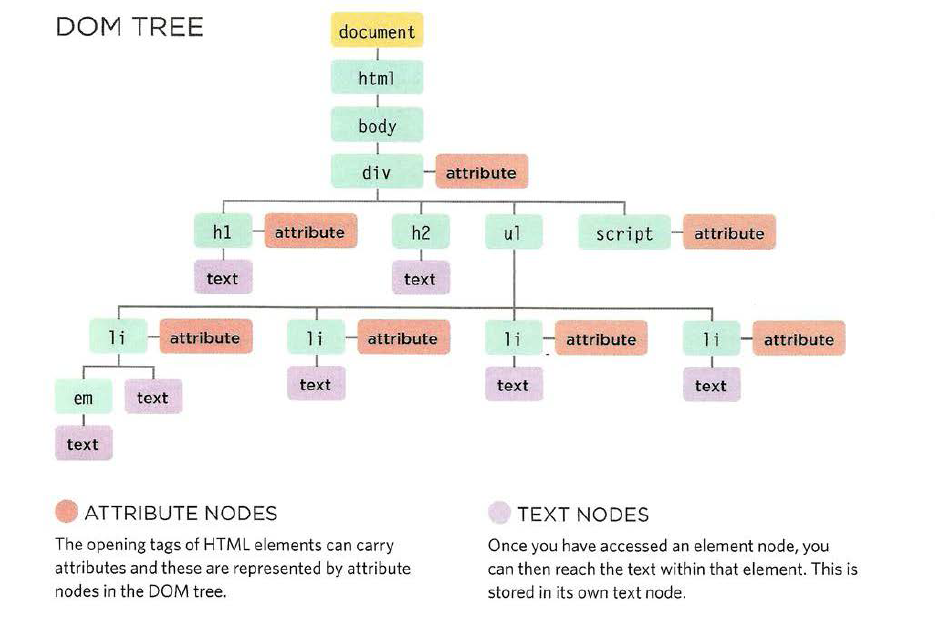
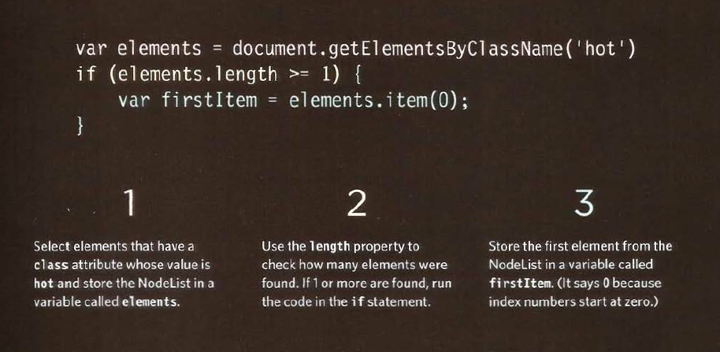
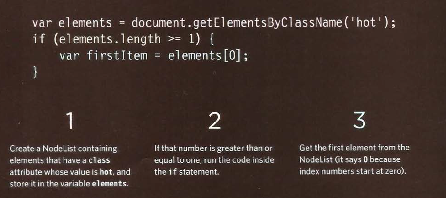

# *The Duckett HTML book*

## *CH03: Object Literals*

Objects group together a set of variables and functions to create a model
of a something you would recognize from the real world. In an object,
variables and functions take on new names.

**Creating an Object:LITERAL NOTATION**

Literal notation is the easiest and most popular way to create objects .

**Accessing an Object: and dot notation**

You access the properities or methods of an object using do notation. You can also access properities using square brackets.

**Creating an Object: Constructor Notation**

The new keyword and the object constructor create a blank object. You can then add properities and methods to the object.

To update the value of properities, use *dot notation* or *square brackets*. They work on objects created using literal or constructor notation.To delete a property, use the *delete keyword*.

## *CH05: Document Object Mode*

The Document Object Model **(DOM)** specifies
how browsers should create a model of an HTML
page and how JavaScript can access and update the
contents of a web page while it is in the browser window.

**WORKING WITH
THE DOM TREE**

Accessing and updating the DOM tree involves two steps:

1: Locate the node that represents the element you want to work with.

2: Use its text content, child elements, and attributes.

**ACCESSING ELEMENTS**

DOM queries may return one element, or they may return a Nodelist,
which is a collection of nodes.

**SELECTING AN ELEMENT
FROM A NODELIST**

There are two ways to select an element from a Nodelist:
The item() method and array syntax.
Both require the index number of the element you want.

*1-THE ;tern{) METHOD.*

*2-ARRAT SYNTAX*

**TRAVERSING THE DOM**
When you have an element node, you can select
another element in relation to it using these five
properties. This is known as traversing the DOM.

**WHITESPACE NODES**

Traversing the DOM can be difficult because
some browsers add a text node whenever they
come across whitespace between elements.

**ADDING ELEMENTS USING
DOM MANIPULATION**
DOM manipulation offers another technique
to add new content to a page (rather than
i nnerHTML). It involves three steps:

*1-CREATE THE ELEMENT*
createEl ement ().

*2-GIVE IT CONTENT *
createTextNode() 

*3-ADD IT TO THE DOM*
appendChild()

| **Conclution** |
| ---------------| 
| Whenever a DOM query can return more than one
node, it will always return a Nadel i st. |            
|From an element node, you can access and update its
content using properties such as textContent and
i nnerHTML or using DOM manipulation techniques.  |            
| An element node can contain multiple text nodes and
child elements that are siblings of each other. |            
| In older browsers, implementation of the DOM is
inconsistent (and is a popular reason for using jQuery). |           
| Browsers offer tools for viewing the DOM tree .   |          
          

