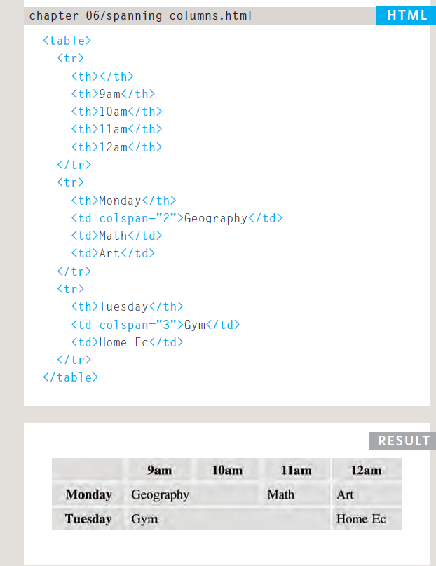
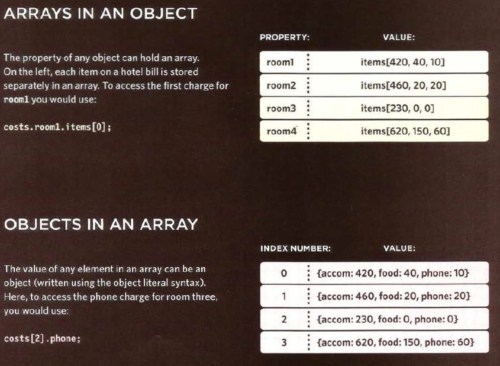

# *The Duckett HTML book*

## *CH06: Tables*

**Tables**:A table represents information in a grid format.

`<table>`

The `<table>` element is used
to create a table. The contents
of the table are written out row
by row.

`<tr>`

You indicate the start of each
row using the opening `<tr>` tag.
(The tr stands for table row.)
It is followed by one or more
`<td>`

 elements (one for each cell
in that row).
At the end of the row you use a
closing `</tr>` tag.

`<td>`

Each cell of a table is
represented using a `<td>`
element. 

`<th>`

The `<th>` element is used just
like the `<td>` element but its
purpose is to represent the
heading for either a column or
a row.

**Spanning ColumnS**

Sometimes you may need the
entries in a table to stretch
across more than one column.
The colspan attribute can be
used on a `<th>` or `<td>` element
and indicates how many columns
that cell should run across.

**Spanning Rows**

You may also need entries in
a table to stretch down across
more than one row.
The rowspan attribute can be
used on a `<th>` or `<td>` element
to indicate how many rows a cell
should span down the table.

**Long Tables**

There are three elements that
help distinguish between the
main content of the table and
the first and last rows.

`<thead>`The headings of the table should
sit inside the `<thead>` element.

`<tbody>`The body should sit inside the
`<tbody>` element.

`<tfoot>`The footer belongs inside the
`<tfoot>` element.

# *the Duckett JS book:*

## **CH03:Functions, Methods, and Objects**

**JavaScript Object Constructors**

first, create an object using a combanation of keyword ang *object()* constructor function. 
then you create the properities using dot notation.

1- To create an empty object : let object ={}.

2- To update the value of properities use dot notation or square bracets.

3- To delete the value of properites, use the *delete* keyword .

4- To clear an properities , just set it to a blank string.

**HOW TO CREATE MANY OBJECTS, Constructor Notation **

Sometimes we want several objects to represent similar things.

**THIS (IT IS A KEYWORD)**

The keyword this is commonly used inside functions and objects.
Where the function is declared alters what this means. It always refers
to one object, usually the object in which the function operates.

**A FUNCTION IN GLOBAL SCOPE** 

When a function is created at the top level of a script
(that is, not inside another object or function), then it
is in the global scope or global context.

**ARRAYS ARE OBJECTS**

The array is a special type of the object . but the key for each value is its index number.

1- Array in an object.

2- Objects in an Array.

**WHAT ARE BUILT-IN
OBJECTS?**

1-browser object model:represent the current
browser window or tab.

2- Global JS model:represent things that the JavaScript
language needs to create a model
of.

3-Document object model:uses
objects to create a representation of
the current page.

