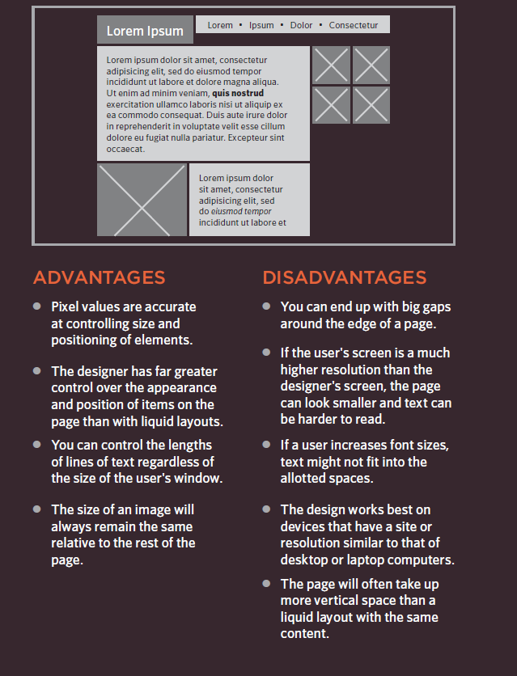

## *CH15: LAYOUT*

how to control where each element sits on a page and how to create attractive page layouts.

**Building Blocks**

CSS treats each HTML element as if it is in its
own box. This box will either be a block-level
box or an inline box.

*Block-level* boxes start on a new line and act as the main building blocks of any layout, while *inline boxes* flow between surrounding text. You can control how much space each box takes up by setting the width of the boxes (and sometimes the height, too). To separate boxes, you can use borders, margins, padding, and background colors.

**Block-level elements**

start on a new line, Examples include:

`<h1>` `
` `<ul>` `<li>`

**Inline elements**

flow in between surrounding text,Examples include:

`` `<b>` `<i>`

**Containing Elements**

If one block-level element sits inside another
block-level element then the outer box is
known as the containing or parent element.

**Controll ing the
Position of El ements**

1- Normal flow.

2-Relative Positioning.

3-Ab solute positioning.

**Screen Sizes**

Different visitors to your site will have different sized screens that show
different amounts of information, so your design needs to be able to
work on a range of different sized screens.

**Screen Resolution**

Resolution refers to the number of dots a screen shows per inch. Some
devices have a higher resolution than desktop computers and most
operating systems allow users to adjust the resolution of their screens.

**Fixed Width Layouts**

Fixed width layout
designs do not
change size as the
user increases
or decreases
the size of their
browser window.
Measurements tend
to be given in pixels.

**Liquid Layouts**

Liquid layout designs
stretch and contract
as the user increases
or decreases the
size of their browser
window. They tend to
use percentages.

**Layout Grids**

use a grid structure to help them
position items on a page, and the same is true for web designers.

**CSS Frameworks**

CSS frameworks aim to make your life easier by providing the code for
common tasks, such as creating layout grids, styling forms, creating
printer-friendly versions of pages and so on.

