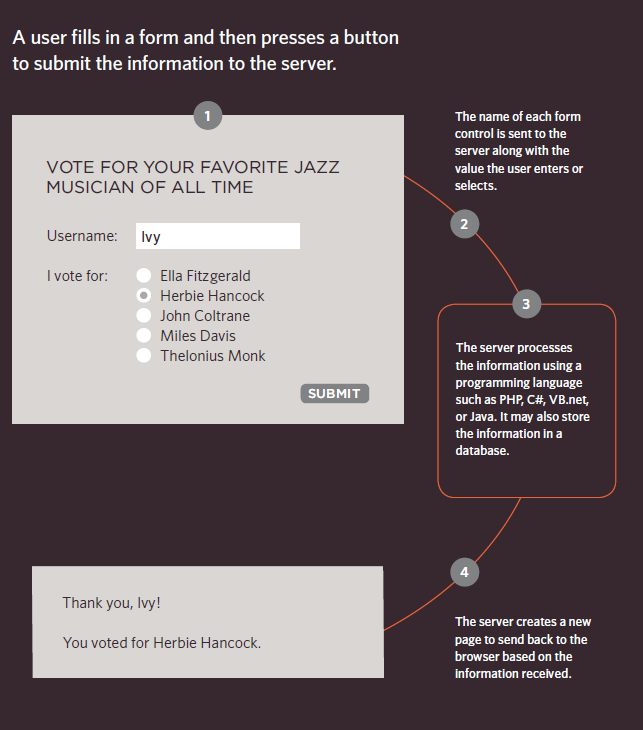
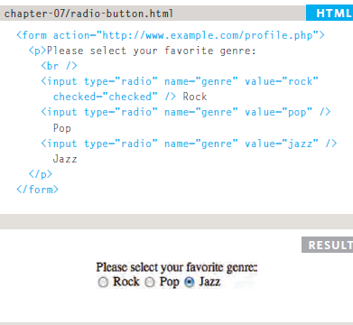
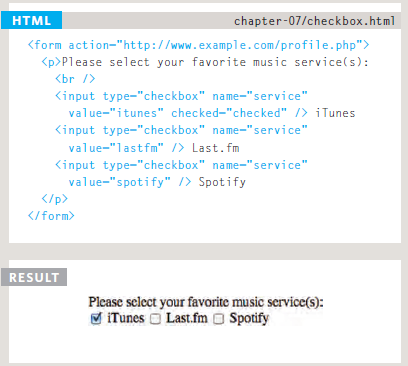
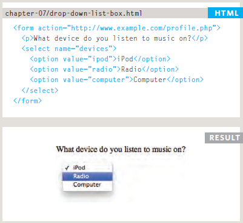
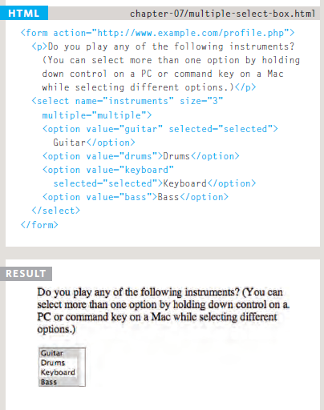
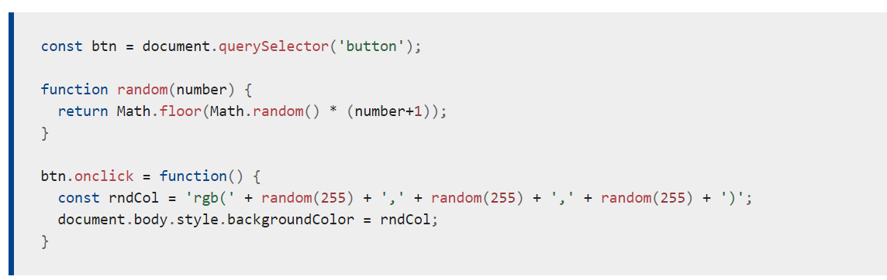
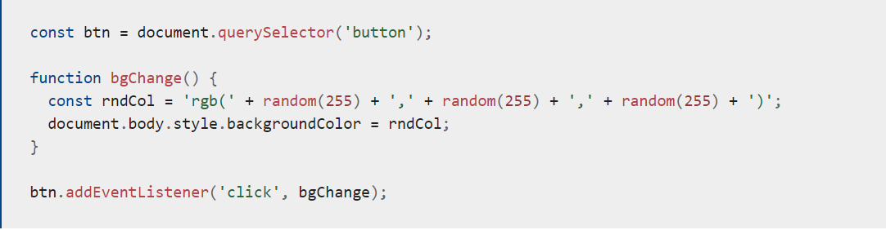
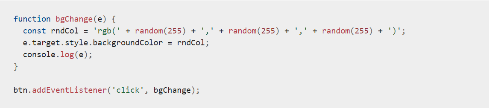

# *The Duckett HTML book*

## *CH07: FORMS*

**Form Controls**

There are several types of form controls that
you can use to collect information from visitors
to your site.

1-* ADDING TEXT:*

Text input (single-line),Password input,Text area.

2-*Making Choices:*

Radio buttons,Checkboxes,Drop-down boxes.

3-*Submitting Forms:*

Submit buttons,Image buttons.

4- *Uploading Files:*

File upload.

**How Forms Work**

`<form>`

Form controls live inside a
`<form>` element. This element
should always carry the action
attribute and will usually have a
method and id attribute too.

action
Every `<form>` element requires
an action attribute. Its value
is the URL for the page on the
server that will receive the
information in the form when it
is submitted.
method
Forms can be sent using one of
two methods: get or post.

`<form action="http://www.example.com/subscribe.php" method="get">`
`
`
`This is where the form controls will appear.`
`
`
`</form>`

1- Text Input

`<input>`

The `<input>` element is used
to create several different form
controls. The value of the type
attribute determines what kind
of input they will be creating.

"type="text",name,size,maxlength"

`<form action="http://www.example.com/login.php">`
`
Username:`
`<input type="text" name="username" size="15"`
`maxlength="30" />`
`
`
`</form>`

2-Password Input 

`<input>`
type="password"
When the type attribute has
a value of password it creates
a text box that acts just like a
single-line text input, except
the characters are blocked out.
They are hidden in this way so
that if someone is looking over
the user's shoulder, they cannot
see sensitive data such as
passwords.

"name,size, maxlength"

3-Text Area

`<textarea>`

The `<textarea>` element
is used to create a mutli-line
text input. Unlike other input
elements this is not an empty
element. It should therefore have
an opening and a closing tag.
Any text that appears between
the opening `<textarea>` and
closing `</textarea>` tags will
appear in the text box when the
page loads.

**Radio Button**

**Checkbox**

**Drop Down List Box**

**Multiple Select Box**

## **CH14:LISTS, TABLES AND FORMS**

**LISTS**

1- list-style-type

The list-style-type property
allows you to control the shape
or style of a bullet point (also
known as a marker).
It can be used on rules that
apply to the `<ol>`, `<ul>`, and `<li>`
elements.

2-list-style-image

You can specify an image to act
as a bullet point using the
list-style-image property.

3- list-style-position

4-list-style

**Table Properties**

*width* to set the width of the
table.

*padding* to set the space
between the border of each table
cell and its content.

*text-transform* to convert the
content of the table headers to
uppercase.

*letter-spacing, font-size*
to add additional styling to the
content of the table headers.

*border-top, border-bottom*
to set borders above and below
the table headers.

*text-align* to align the writing
to the left of some table cells and
to the right of the others.

*background-color* to change
the background color of the
alternating table rows.

*:hover* to highlight a table row
when a user's mouse goes over it.

## **The Duckett JS book**

### **CH06:EVENTS**

**Events**are actions or occurrences that happen in the system you are programming, which the system tells you about so you can respond to them in some way if desired. For example, if the user selects a button on a webpage, you might want to respond to that action by displaying an information box. In this article, we discuss some important concepts surrounding events, and look at how they work in browsers. This won't be an exhaustive study; just what you need to know at this stage.

1- Prerequisites:	Basic computer literacy, a basic understanding of HTML and CSS, JavaScript first steps.

2- Objective:	To understand the fundamental theory of events, how they work in browsers, and how **events**may differ in different programming environments.

In the case of the Web, **events**are fired inside the browser window, and tend to be attached to a specific item that resides in it — this might be a single element, set of elements, the HTML document loaded in the current tab, or the entire browser window.
There are many different types of **events**that can occur:

1- The user selects a certain element or hovers the cursor over a certain element.

2- The user chooses a key on the keyboard.

3-The user resizes or closes the browser window.

4-A web page finishes loading.

5-A form is submitted.

6-A video is played, paused, or finishes.

7-An error occurs.

*Web   **events**are not part of the core JavaScript language — they are defined as part of the APIs built into the browser.

For example, we have a single `<button>`, which when pressed, makes the background change to a random color:

`<button>Change color</button>`

The earliest method of registering event handlers found on the Web involved event handler HTML attributes (or inline event handlers) like the one shown above — the attribute value is literally the JavaScript code you want to run when the event occurs. 

`<button onclick="alert('Hello, this is my old-fashioned event handler!');">Press me</button>`

The modern mechanism for adding event handlers is the addEventListener() method.

**What mechanism should I use?**

Of the three mechanisms, you shouldn't use the HTML event handler attributes — these are outdated, and bad practice.

The other two are relatively interchangeable, at least for simple uses:

1- Event handler properties have less power and options, but better cross-browser compatibility (being supported as far back as Internet Explorer 8). You should probably start with these as you begin learning.

2- DOM Level 2 Events (`addEventListener()`, etc.) are more powerful, but can also become complex and are less well supported (supported as far back as Internet Explorer 9). You should also experiment with these, and try to use them where possible.

The main advantages of the third mechanism are that you can remove event handler code if needed, using `removeEventListener()`, and you can add multiple listeners of the same type to elements if required. 

For example, you can call addEventListener(`'click'`, function() { ... }) on an element multiple times, with different functions specified in the second argument. 

**Event objects**

Sometimes inside an event handler function, you'll see a parameter specified with a name such as event, evt, or e. This is called the event object, and it is automatically passed to event handlers to provide extra features and information.

