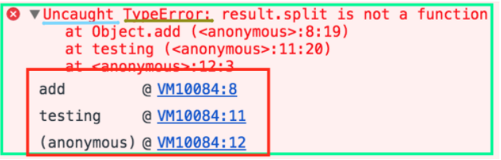
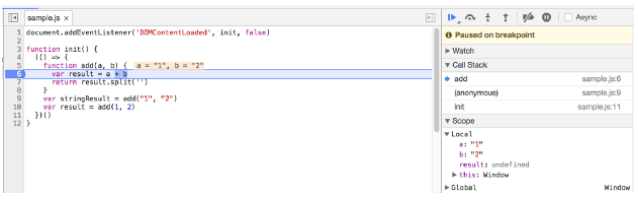
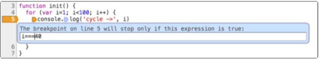
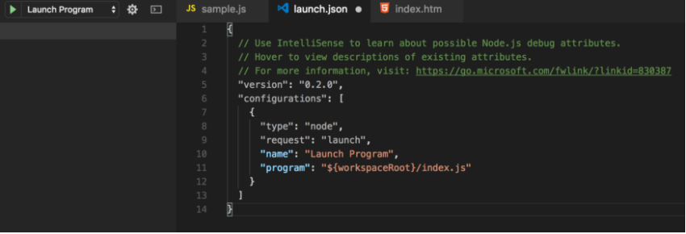
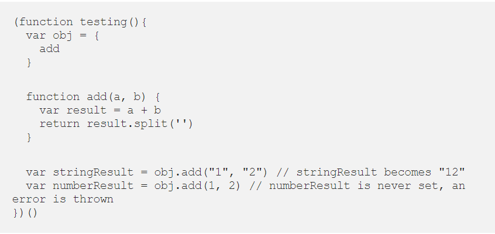

## **The Duckett JS book**

### **CH12:ERROR HANDLING AND DEBUGGING**

The JavaScript interpreter uses the concept of execution contexts.
There is one global execution context; plus, each function creates a new
new execution context. They correspond to variable scope.

**THE STACK**
Most of your time as a developer is spent reading code followed by debugging that same code, most likely to be able to read it or solve an “unexpected feature” (which, joking aside, is more correctly known as a “bug”).

This is a sample of an error, the green is the overall error message, the light blue is to note if the error was properly handled, the brownish (dark yellow) is the type of error and the red is the call stack.

**Types of error messages**

The first thing that indicates you that something is wrong with your code is the (in)famous error message that the one we saw just moments ago, it usually appears on your console (being developer tools of the browser, terminal or whatever else you are using).

1- Reference errors

`console.log(foo) // Uncaught ReferenceError: foo is not defined`

`foo = 'Hello' // Uncaught ReferenceError: foo is not defined`

`let foo`

Whatever you are using (var, let or const) the fix is as simple has declaring the variable before any declaration is made.

`let foo;`

`foo = 'Hello'`

2- Syntax errors

this occurs when you have something that cannot be parsed in terms of syntax, like when you try to parse an invalid object using JSON.parse

`JSON.parse( {'foo': 'bar'} ) // Uncaught SyntaxError: Unexpected token o in`

`JSON at position 1`

This can be solved by just fixing the syntax, in this case the object should be a JSON.

`JSON.parse('{"foo":"bar"}')`

Some syntax errors like sending a trailing comma when calling a function are handled without error by most recent browsers, but older ones you have to be careful.

3- Range errors

Try to manipulate an object with some kind of length and give it an invalid length and this kind of errors will show up.

`var foo= []`

`foo.length = foo.length -1 // Uncaught RangeError: Invalid array length`

An array for instance cannot have a negative length, why would you mess with the array length? Some people use it to set an array to empty, something of the likes of:

`var foo = [0, 0]`

`foo.length = foo.length - 2 // (or foo.length - foo.length)`

`foo // would log [] instead of [0, 0]`

I prefer not to mutate my variables whenever possible (making them constants and not variables) but this is a method that is available and now you know it.

4- Type errors

Like the name indicates, this types of errors show up when the types (number, string and so on) you are trying to use or access are incompatible, like accessing a property in an undefined type of variable.

`var foo = {}`

`foo.bar // undefined`

`foo.bar.baz // Uncaught TypeError: Cannot read property 'baz' of undefined`

This is probably the most frequent error in JS, trying to access a property/method thinking that bar is of the type object when in reality, since it hasn’t been declared yet, it’s undefined which doesn’t have any baz available.
The fix is simple, just make sure that bar exists before trying to access it, either by creating bar or by checking for undefined.

`var foo = { bar: {} }`

`foo.bar.baz // undefined but you avoid the error`

or

`var foo = {}`

`if (typeof foo.bar !== 'undefined') {`

  `foo.bar.baz // this will never be executed while bar does not exist`

`}`

There are also warnings, for instance telling you about a deprecated method, which can be found more frequently in firefox developer tools.

**Debugging**

To debug your JS code, the easiest and maybe the most common way its to simply console.log() the variables you want to check or, by using chrome developer tools, open your page with your JS code (press cmd+o in macOS or Ctrl+o in Windows) and choose your file to debug, click the line you wanna debug and refresh your page again (F5).

If the line you selected was run you will be able to see what has happened before that point and you can try and evaluate the next lines to check if everything is outputting what you are expecting.

The breakpoint can also be achieved by putting a debugger statement in your code in the line you want to break.

You can also add conditional breakpoints by right-clicking a previous set breakpoint, which will make your program stop at that point only if a condition is met, this is awesome for when you want to debug huge cycles for specific values. In this example the breakpoint will point stop when the index reaches 40.

Using Node.js with Visual Studio Code you can press the debug tab and add a configuration similar to this:

You can run the debugger by pressing F5 or pressing the green play button.

**Call stack**

The red part of our first example represents the call stack, which is the path that your program has taken to reach the point were you set a breaking point or were you have an error.

1-testing is automatically called since it’s an IIFE (immediately Invoked Function Expression);

2- obj variable is declared with the function add (using ES6 shorthand for functions in objects, it would be the same having `var obj = { add: add } ;`

3the function add is called from the obj variable with two strings has parameters, there are added which makes them “12” in this scenario and then split is called before returning [“1”, “2”];

4-the function add is called again, this time with number, the values are added making it 3 but then, split (which is not available for number type variables) is called which makes an error being thrown;

The call stack it’s better to navigate when you have names to your functions, meaning that if you use anonymous functions you will most probably have an harder time since the call stack will not show the name of the parent function.

For example, if we remove it from the object and call it directly not much changes, but if we remove the name of, let us say testing function, the call stack will no longer be able to point you the origin of the call (you can still press the underline and it will show you but that is an extra step that could be avoided.

I would not insist in using the object to have the function, but I would recommend vividly of adding names to your functions whenever possible so that the call stack is more readable without having to dive into each step.
Another way to see the stack trace at any given point in your code is to just write console.trace() were you want to log it.

