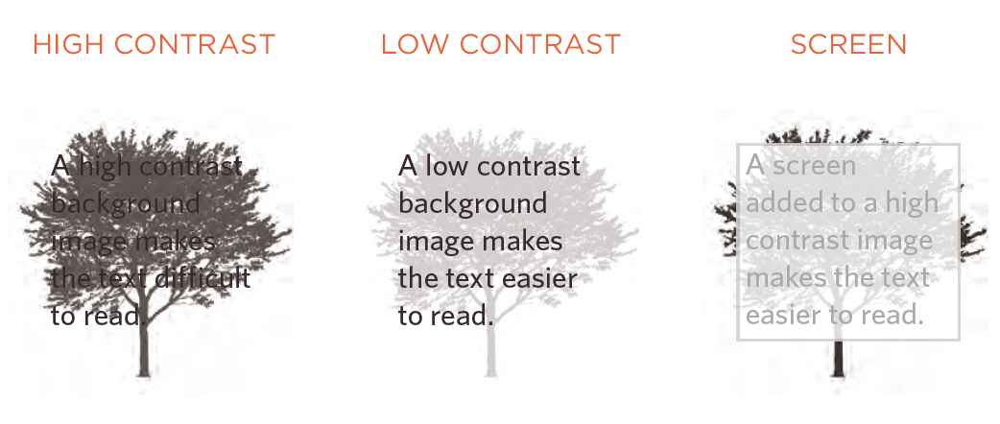
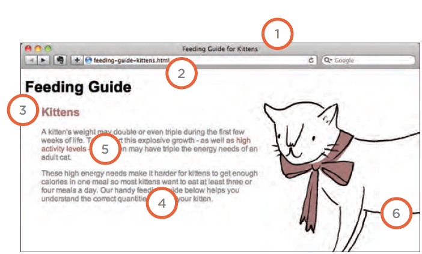

# *The Duckett HTML book*

## *CH16: IMAGES*

**Background Images**

`background-image`  The background-image
property allows you to place
an image behind any HTML
element. This could be the entire
page or just part of the page. By
default, a background image will
repeat to fill the entire box.

`p {`

`background-image: url("images/pattern.gif");`

`}`

**Repeating Images**

`background-repeat`

`background-attachment`

1- repeat 

2- no-repeat

3-repeat -y

4-repeat-x

5- fixed

6-scroll

**Background Position**

`background-position`

When an image is not being
repeated, you can use the
background-position
property to specify where in the
browser window the background
image should be placed.

**Contrast of background images**

If you want to overlay text on a background image, the image must be low
contrast in order for the text to be legible.

## *CH19: Practical Information*

**Search Engine Optimization (SEO)**

Search engine optimization (or
SEO) is the practice of trying
to help your site appear nearer
the top of search engine results
when people look for the topics
that your website covers.

On-page techniques are the
methods you can use on your
web pages to improve their
rating in search engines.

Getting other sites to link to you
is just as important as on-page
techniques. Search engines help
determine how to rank your
site by looking at the number of
other sites that link to yours.

**there are seven key places where keywords:

1- Page Title

2- URL / Web Address

3- Headings

4- Link Text

5- Image Alt Text

6- Page Descriptions

**1- How to Identify Keywords and Phrases**

**2- Analytics: Learning about your Visitors**

**3- How Many People Are Coming to Your Site?**

**4- What Are Your Visitors Looking At?** 

**5- Where Are Your Visitors Coming From?**

**6- Domain Names & Hosting**

**7- FT P & Third Party Tools**

