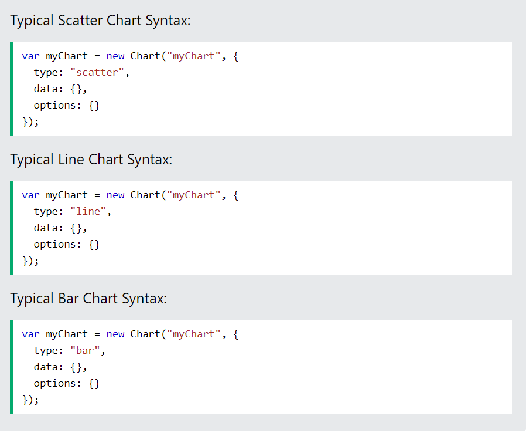
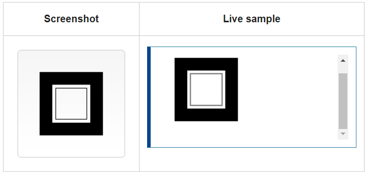

## **CREATE ANIMATED CHARTS WITH CHART.JS**

Charts are far better for displaying data visually than tables.we’ll use a bar chart to show profit over the period.

Chart.js comes with the following built-in chart types:

1-Scatter

2- Line

3-Bar

4-Radar

5-Pie and Doughnut

6-Polar Area

7- Bubble

**How to Use Chart.js?**

First, add a link to the providing CDN (Content Delivery Network).

Then, add a <canvas> to where you want to draw the chart.

The canvas element must have a unique id.

**Drawing shapes with canvas**

how to draw rectangles, triangles, lines, arcs and curves, providing familiarity with some of the basic shapes.

 *Drawing rectangles*

`function draw() {`
  `var canvas = document.getElementById('canvas');`
  `if (canvas.getContext) {`
    `var ctx = canvas.getContext('2d');`
    `ctx.fillRect(25, 25, 100, 100);`
    `ctx.clearRect(45, 45, 60, 60);`
    `ctx.strokeRect(50, 50, 50, 50);`
  `}`
`}`

This example's output:

