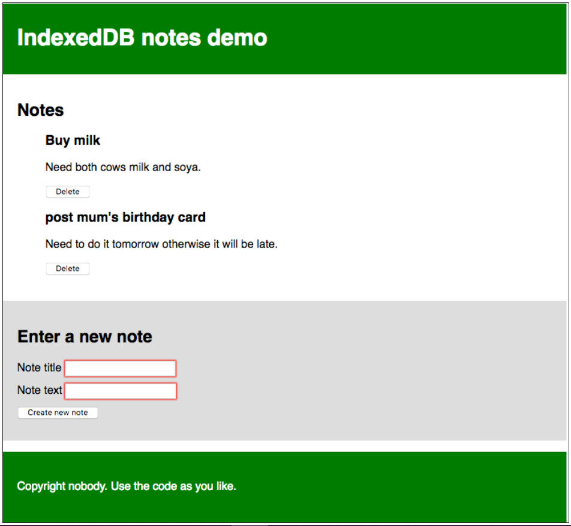

##  **LOCAL STORAGE FOR WEB APPLICATIONS**

With web storage, web applications can store data locally within the user's browser.

Before HTML5, application data had to be stored in cookies, included in every server request. Web storage is more secure, and large amounts of data can be stored locally, without affecting website performance.

Unlike cookies, the storage limit is far larger (at least 5MB) and information is never transferred to the server.

Web storage is per origin (per domain and protocol). All pages, from one origin, can store and access the same data.

HTML web storage provides two objects for storing data on the client:

window.localStorage - stores data with no expiration date
window.sessionStorage - stores data for one session (data is lost when the browser tab is closed).

`localStorage.lastname = "Smith";`

`document.getElementById("result").innerHTML = localStorage.lastname;`

**The sessionStorage Object**

The sessionStorage object is equal to the localStorage object, except that it stores the data for only one session. The data is deleted when the user closes the specific browser tab.

**Getting started**

1- First of all, make local copies of our index.html, style.css, and index-start.js files into a new directory on your local machine.

2- Have a look at the files. You'll see that the HTML is pretty simple: a web site with a header and footer, as well as a main content area that contains a place to display notes, and a form for entering new notes into the database. The CSS provides some simple styling to make it clearer what is going on. The JavaScript file contains five declared constants containing references to the `<ul>` element the notes will be displayed in, the title and body `<input>` elements, the `<form>` itself, and the `<button>`.

3- Rename your JavaScript file to index.js. You are now ready to start adding code to it.