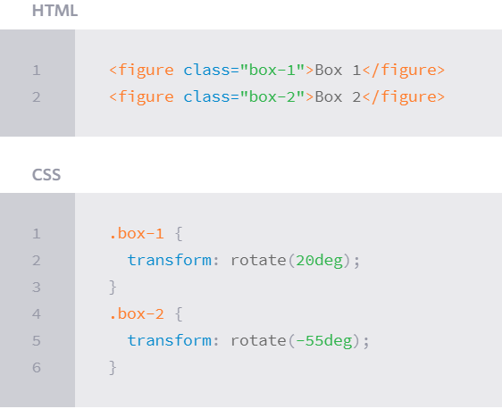
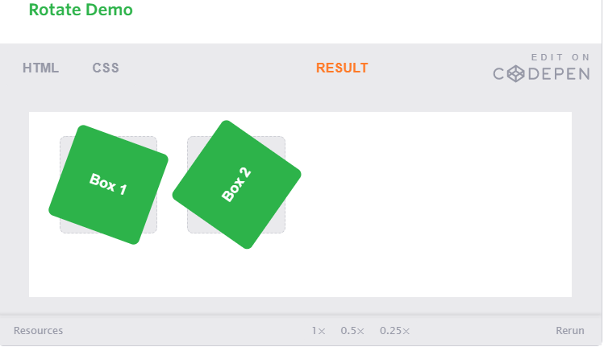
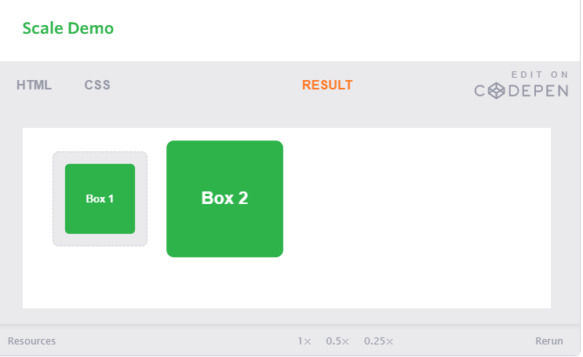
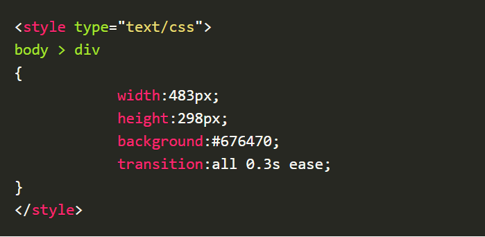

## **Transforms**

The transform property comes in two different settings, two-dimensional and three-dimensional. Each of these come with their own individual properties and values.

The actual syntax for the transform property is quite simple, including the transform property followed by the value. The value specifies the transform type followed by a specific amount inside parentheses.

`div {`
 ` -webkit-transform: scale(1.5);`
    ` -moz-transform: scale(1.5);`
      ` -o-transform: scale(1.5);`
         ` transform: scale(1.5);`
`}`

1- *2D Rotate*

The transform property accepts a handful of different values. The rotate value provides the ability to rotate an element from 0 to 360 degrees. Using a positive value will rotate an element clockwise, and using a negative value will rotate the element counterclockwise. The default point of rotation is the center of the element, 50% 50%, both horizontally and vertically. Later we will discuss how you can change this default point of rotation.

2- *2D Scale*

Using the scale value within the transform property allows you to change the appeared size of an element. The default scale value is 1, therefore any value between .99 and .01 makes an element appear smaller while any value greater than or equal to 1.01 makes an element appear larger.

HTML:

`<figure class="box-1">Box 1</figure>`

`<figure class="box-2">Box 2</figure>`

`<figure class="box-3">Box 3</figure>`

CSS:

`.box-1 {`

  `transform: scaleX(.5);`

`}`

`.box-2 {`

  `transform: scaleY(1.15);`

`}`

`.box-3 {`

  `transform: scale(.5, 1.15);`

`}`

3- *2D Skew*

4- *2D Translate*

**Combining Transforms**

It is common for multiple transforms to be used at once, rotating and scaling the size of an element at the same time for example. In this event multiple transforms can be combined together. To combine transforms, list the transform values within the transform property one after the other without the use of commas.

**Transform Origin**

As previously mentioned, the default transform origin is the dead center of an element, both 50% horizontally and 50% vertically. To change this default origin position the transform-origin property may be used.

**Perspective**

1- *Perspective Depth Value*

2- *Perspective Origin*

**3D Transforms**

1- *3D Rotate*

2- *3D Scale*

3- *3D Translate*

4- *3D Skew*

5- *Shorthand 3D Transforms*

**Transform Style**

On occasion three-dimensional transforms will be applied on an element that is nested within a parent element which is also being transformed. In this event, the nested, transformed elements will not appear in their own three-dimensional space.

**Backface Visibility**

## **8 SIMPLE CSS3 TRANSITIONS THAT WILL WOW YOUR USERS**

CSS3 has introduced countless possibilities for UX designers, and the best thing about them is that the coolest parts are really simple to implement.

1. Fade in

        `.fade{`

        `opacity:0.5;`

         `}`

         `.fade:hover{`

           `opacity:1;`

           `}`

2. Change color

         .color:hover
        {
        background:#53a7ea;
         }

3. Grow & Shrink

          .grow:hover
         {
        -webkit-transform: scale(1.3);
        -ms-transform: scale(1.3);
        transform: scale(1.3);
          }

 4. Rotate elements

          .rotate:hover
         {
        -webkit-transform: rotateZ(-30deg);
        -ms-transform: rotateZ(-30deg);
        transform: rotateZ(-30deg);
         }

5. Square to circle

        .circle:hover
         {
         border-radius:50%;
         }

6. 3D shadow

          .threed:hover
          {
        box-shadow:
                1px 1px #53a7ea,
                2px 2px #53a7ea,
                3px 3px #53a7ea;
        -webkit-transform: translateX(-3px);
        transform: translateX(-3px);
          }

 7. Swing

 8. Inset border

     .border:hover
     {
        box-shadow: inset 0 0 0 25px #53a7ea;
      }       

