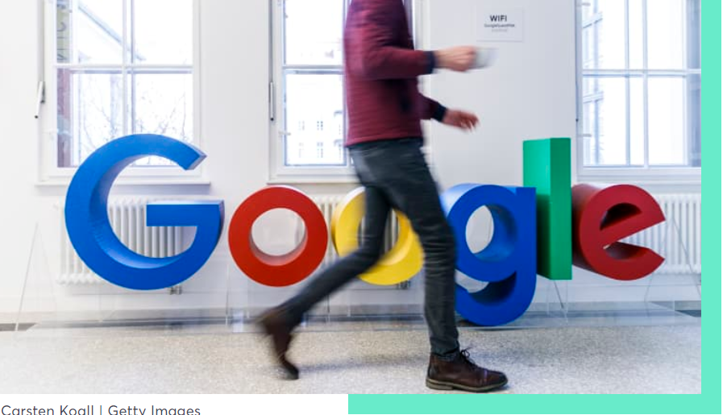

## **What Google Learned From Its Quest to Build the Perfect Team**

Each person has their own appetite, which can make creating a “shared-interest” extremely challenging.

**The key characteristics of ‘enhanced teams’**

the researchers found that there were five key characteristics of enhanced teams:

1- *Psychological safety:* 

   Everyone feels safe in taking risks around their team members, and that they won’t be embarrassed or punished for doing so.

2- *Dependability:* 

Everyone completes quality work on time.

3- *Structure and clarity:* 

Everyone knows what their specific expectations are. These expectations must be challenging yet attainable.

4- *Meaning:* 

Everyone has a sense of purpose in their work (i.e., financial security, supporting family, helping the team succeed, etc.).

5- *Impact:* 

Everyone sees that the result of their work actually contributes to the organization’s overall goals.

To read more about THis,
[Click here](https://www.nytimes.com/2016/02/28/magazine/what-google-learned-from-its-quest-to-build-the-perfect-team.html)
